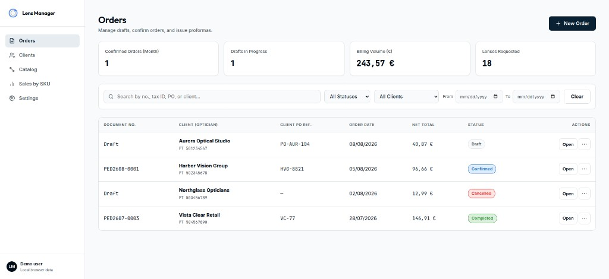
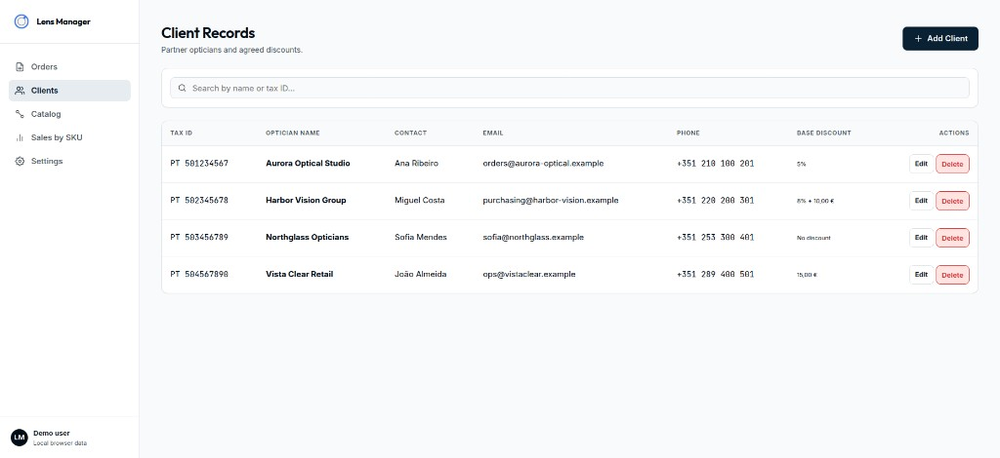
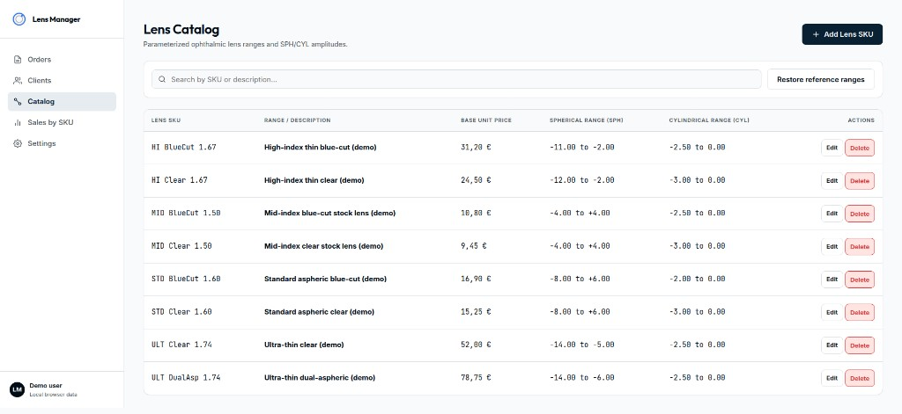
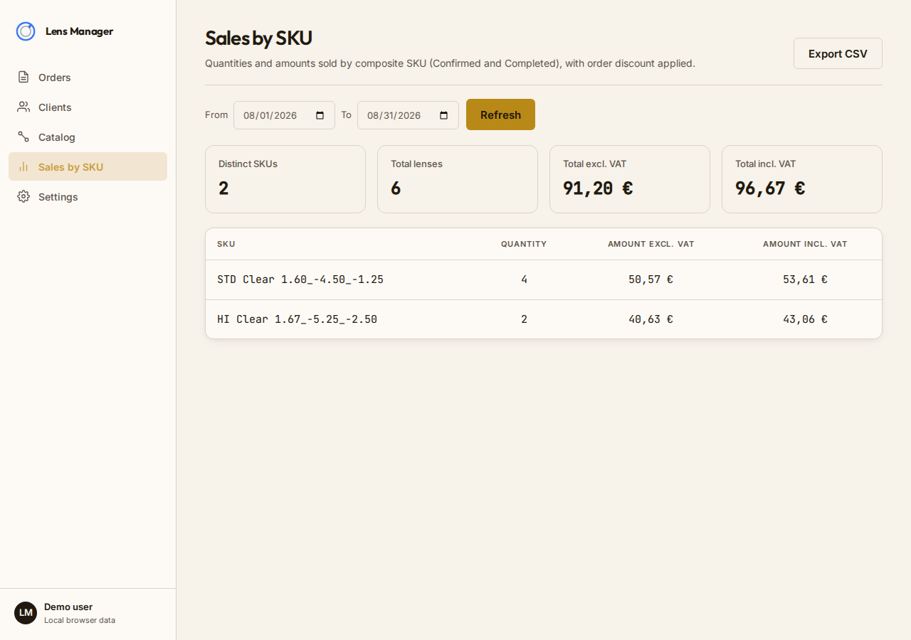
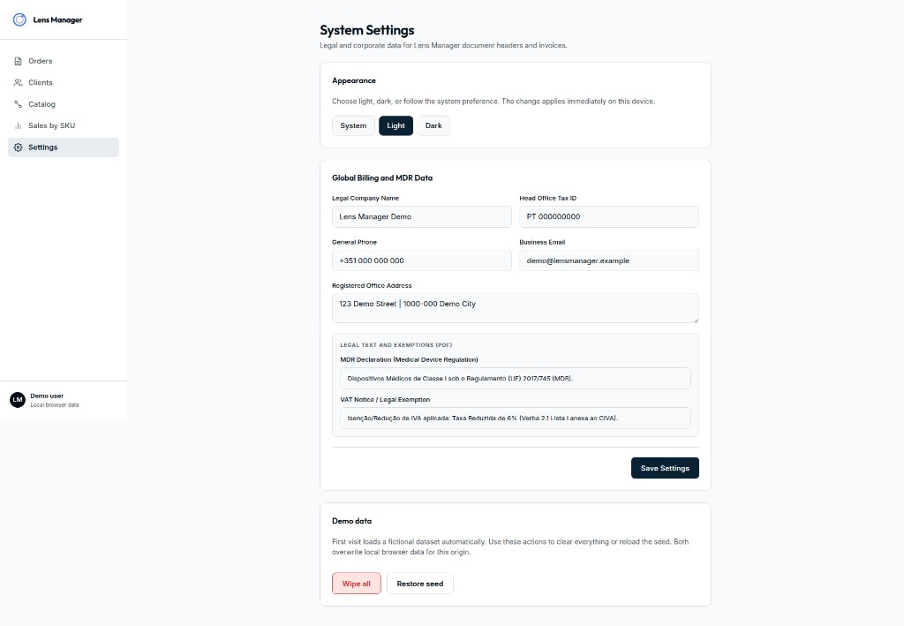
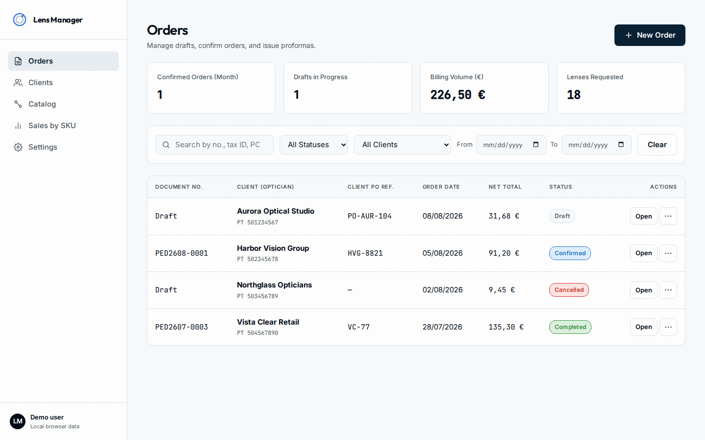
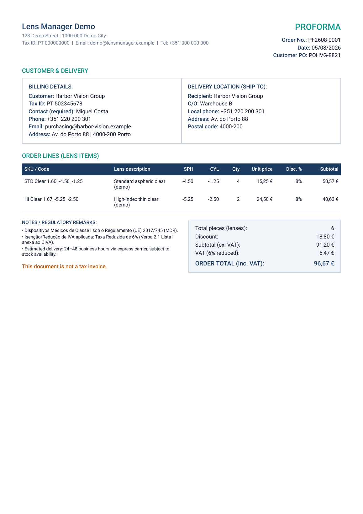

# Lens Manager

Portfolio demo PWA for **lens order management** — clients with delivery locations, a SPH/CYL catalog, order lifecycle (draft → confirm → complete), proforma PDFs, and a sales-by-SKU report. Data lives in the browser; no backend or login required.

**Live demo:** [daltondjoesman.github.io/template-lensManager](https://daltondjoesman.github.io/template-lensManager/)

## Why

Optical wholesale and lab workflows need a clear path from client → catalog SKU → confirmed order → printable document. This template shows that domain end-to-end as a self-contained demo you can open, explore, wipe, and restore — useful as a portfolio piece and as a starting point for a production adapter.

## Features

- **Clients** with billing details, unique tax ID, named delivery locations, default payment terms (due on receipt / net 30), and optional default discounts
- **Catalog** of lens families (SKU, price, SPH/CYL amplitude ranges); order lines compose `{sku}_{sph}_{cyl}`
- **Orders** across Draft / Confirmed / Completed / Cancelled, with PED/PF numbering, sticky proforma issue time, line and order discounts, IVA, multi-select status/client filters, and sortable columns
- **Proforma PDF** generation (pdfmake) with payment terms, demo bank details, and company MDR/IVA notes (order PDF has a payment badge only)
- **Sales by SKU** report over confirmed/completed orders
- **System / Light / Dark** theme preference
- **PWA** installability via `vite-plugin-pwa`
- **Demo seed** on first visit, plus Settings actions to wipe all or restore the seed

## Screenshots

| Orders | Clients | Catalog |
|--------|---------|---------|
|  |  |  |

| Sales by SKU | Settings |
|--------------|----------|
|  |  |

### Proforma PDF

Orders → open a confirmed order → **Generate Proforma (PF)** → browser downloads the document (pdfmake, client-side):



Still of the generated proforma:



## Tech stack & tools

| Layer | Choice |
|-------|--------|
| App | Vite 8, React 19, TypeScript, React Router |
| Documents | pdfmake |
| Offline / install | vite-plugin-pwa |
| Persistence | `LocalStorageAdapter` implementing `StorageAdapter` |
| Lint | oxlint |

**Tooling used to build this:** [Cursor](https://cursor.com) (IDE + agents), [OpenSpec](https://github.com/Fission-AI/OpenSpec) for change proposals / specs / tasks, and the Vite React TypeScript toolchain above.

## Architecture

```
src/
  pages/           # Route screens (orders, clients, catalog, settings, report)
  components/      # Shell, nav, shared UI
  lib/             # Domain CRUD, PDF, theme, demo lifecycle
    storage/       # StorageAdapter + LocalStorageAdapter
  data/seed.ts     # Versioned fictional demo dataset
  types/           # Domain models
```

- **UI → domain libs → `StorageAdapter`.** Screens never talk to `localStorage` directly.
- **Collections:** `clients`, `products`, `orders`; singleton `company` settings; monthly counters for PED/PF.
- **Demo lifecycle** (`src/lib/demoData.ts`): first-run seed once (marker), wipe without auto-reseed, restore seed wholesale.

## Run locally

```bash
npm install
npm run dev
```

Open the URL Vite prints (typically `http://localhost:5173/`).

```bash
npm run build    # typecheck + production bundle
npm run preview  # serve the build
npm run lint
```

Optional demo lifecycle smoke test (Node + localStorage polyfill):

```bash
npx tsx scripts/smoke-demo-data.ts
```

## Demo data & reset

On **first visit** (no demo marker in localStorage), the app loads fictional clients, catalog SKUs, and orders spanning several statuses. Content is invented — no real company identity or personal data.

In **Settings → Demo data**:

| Action | Effect |
|--------|--------|
| **Wipe all** | Deletes clients, catalog, and orders; resets company fields to neutral placeholders; sets marker to `wiped` so the empty state is **not** auto-reseeded |
| **Restore seed** | Replaces domain data with the seed module and demo company defaults |

Both actions ask for confirmation; cancel leaves data unchanged.

## Template → production (Firebase)

The demo uses `LocalStorageAdapter`. For multi-user sync:

1. Implement `StorageAdapter` against **Firestore** (same collection/singleton/counter semantics).
2. Add **Firebase Auth** and gate the shell; map users/tenants as needed.
3. Use a Firestore transaction (or equivalent) inside `allocateCounter` for PED/PF sequences.
4. Swap the export in `src/lib/storage/index.ts` to your Firebase adapter — domain libs and UI stay the same.

A short sketch of this swap already lives as comments on the storage index module.

## AI-assisted development

This project was built with assistance from **Grok 4.5** and **Composer 2.5** inside Cursor. Change proposals were drafted locally with OpenSpec; those files are not in this repository. Architecture choices, product decisions, and final review remain author-owned — the models accelerated scaffolding and iteration; they did not replace product judgment.

## What I'd build next

- Firebase Auth + Firestore adapter behind a feature flag
- Soft deletes / audit trail on order status changes
- Better mobile order-entry ergonomics (SPH/CYL steppers, barcode SKU scan)
- Hosted demo URL with a pinned seed reset schedule

## License

[MIT](LICENSE)
